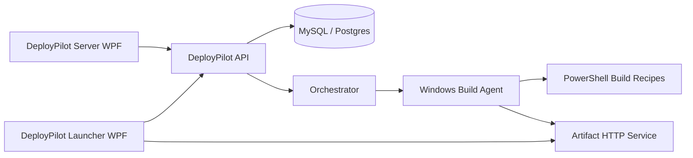

# DeployPilot

[English](README.md) | [Español](docs/es/README.md)

DeployPilot is a build orchestration and versioned distribution platform for teams that ship desktop applications to many customers, machines or tenants. It replaces manual file copying with a controlled flow: register repositories, build modules through recipes, publish signed artifacts, let launchers detect updates, and keep a rollback history.

> Portfolio status: this repository contains the first working product skeleton, core domain logic, tests, API endpoints, Windows UI shells, build recipes and bilingual documentation.

## Why DeployPilot?

- Multi-organization deployment model.
- Safe build queue with locks per organization, repository and module.
- Agent-side Git synchronization with branch or SHA checkout.
- Version history by semantic version and Git SHA.
- Artifact publishing through local storage + HTTP.
- Launcher-side update checks, progress, integrity validation and rollback.
- Build recipes for .NET SDK, MSBuild, WinForms, FoxPro and custom commands.
- Repository probing for solution/project detection and recipe suggestions.
- English/Spanish localization from day one.

## Architecture



## Projects

| Project | Purpose |
| --- | --- |
| `DeployPilot.Server` | Windows admin/tray console for setup, diagnostics, metrics and build visibility. |
| `DeployPilot.Launcher` | Client updater/installer UI with localization and version actions. |
| `DeployPilot.Api` | REST API for organizations, repositories, modules, builds, versions and launcher checks. |
| `DeployPilot.Client` | Shared HTTP SDK used by Windows clients and future tooling. |
| `DeployPilot.Persistence` | EF Core storage layer for InMemory, Postgres/Supabase and MySQL. |
| `DeployPilot.Orchestrator` | Build queue and worker coordination service. |
| `DeployPilot.Artifacts` | Lightweight HTTP artifact server. |
| `DeployPilot.Agent` | Windows-native build agent that selects recipes. |
| `DeployPilot.Shared` | Domain models, queue, versioning, manifests, localization and validation. |
| `DeployPilot.Tests` | xUnit unit tests. |
| `DeployPilot.IntegrationTests` | Core workflow tests. |

## Quick Start

```powershell
dotnet restore
dotnet test
dotnet run --project DeployPilot.Api
dotnet run --project DeployPilot.Artifacts
```

Optional demo infrastructure:

```powershell
docker compose up -d postgres mysql deploypilot-api deploypilot-artifacts deploypilot-orchestrator
```

The API reads persistence settings from configuration:

```json
{
  "Persistence": {
    "Provider": "Postgres",
    "ConnectionString": "Host=localhost;Port=5432;Database=deploypilot;Username=deploypilot;Password=deploypilot"
  }
}
```

Supported provider values are `InMemory`, `Postgres` and `MySql`. Supabase uses the `Postgres` provider with its pooled or direct connection string.

The Windows apps can be launched from Visual Studio or with:

```powershell
dotnet run --project DeployPilot.Server
dotnet run --project DeployPilot.Launcher
```

For a quick end-to-end demo, start the API, open the launcher, click `Seed demo data`, then `Refresh`. The launcher reads modules from the API and checks each module for available versions.

## Supported Build Recipes

- MSBuild classic
- .NET SDK
- C# WinForms
- VB.NET WinForms
- FoxPro configurable command
- Custom command

## Repository Probing

DeployPilot can inspect a repository folder and suggest build technologies from common desktop project files:

```http
POST /api/repositories/probe
{
  "repositoryPath": "C:/source/my-desktop-app"
}
```

The probe currently detects `.sln`, `.csproj`, `.vbproj`, `.pjx` and `.prg` files while ignoring build output folders such as `bin`, `obj`, `.git` and `node_modules`.

## Agent Git Sync

The Windows build agent prepares a deterministic Git sync plan for every leased build job. It clones missing repositories, fetches existing repositories, and checks out the requested SHA when one is provided. Git execution is disabled by default through:

```json
{
  "Agent": {
    "ExecuteGit": false,
    "ExecuteRecipes": false
  }
}
```

This keeps demos safe while still making the production path explicit.

## Roadmap

- Agent registration and signed job tokens.
- Tray notifications and Windows service installation.
- Git credential UI and repository probing.
- Screenshot-ready setup wizard.
- Artifact signing.
- Supabase starter guide.

## Branching Model

DeployPilot uses short-lived feature and hotfix branches. Feature branches introduce product capabilities, hotfix branches keep the repository healthy or fix narrow defects, and `main` receives reviewed merge commits so the public history stays readable.

## Documentation

- [Architecture](docs/en/architecture.md)
- [Server setup](docs/en/server-setup.md)
- [Launcher setup](docs/en/launcher-setup.md)
- [Build recipes](docs/en/build-recipes.md)

## Testing

DeployPilot uses xUnit:

```powershell
dotnet test
```

The current suite covers version comparison, update resolution, build locks, cancellation, manifests, integrity checks, recipe selection, localization fallback, setup validation, EF persistence, HTTP client validation, recipe planning and the core deployment workflow.
